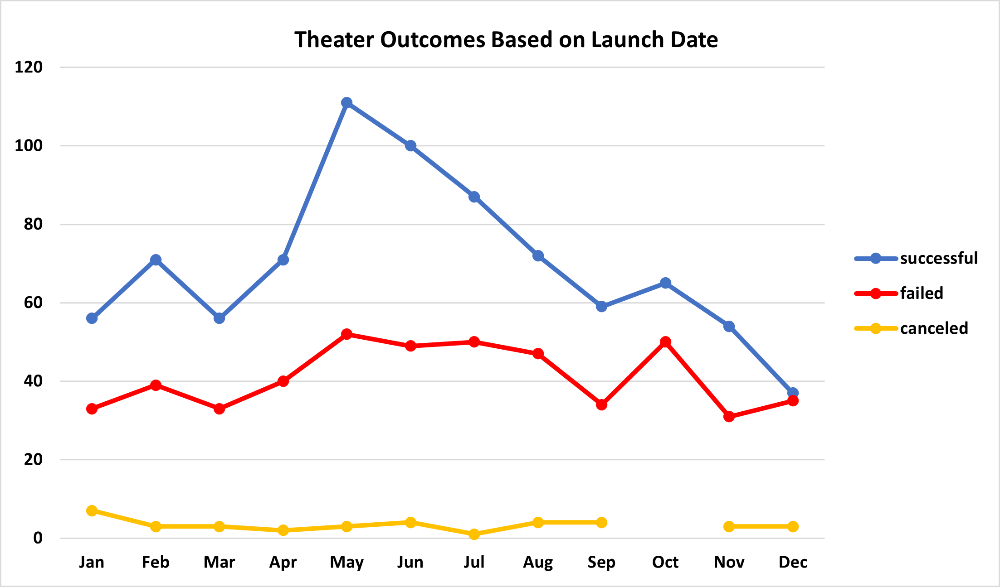
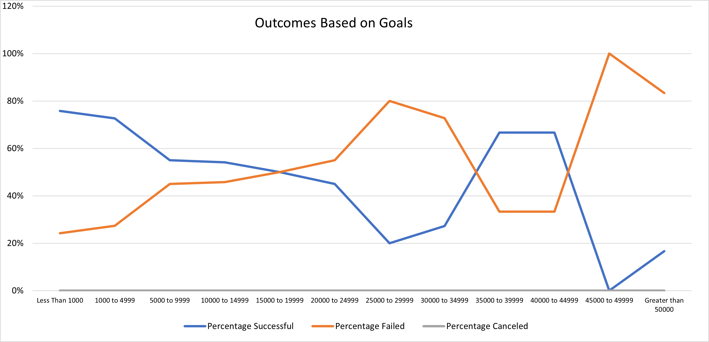

# Kickstarting with Excel

## An Analysis of Kickstarter Campaigns

### Background
Louise's play _Fever_ was close to hitting its fundraising goal in a short amount of time. She wants to understand how different campaigns fared based on their launch dates and fundraising goals. 

### Purpose
The purpose of this analysis was help Louise answer her question. Using visualizations from the Kickstarter dataset, I analyzed how launch dates and fundraising goals affected four outcomes: successful, failed, live, and canceled. This analysis will help Louise determine the success of her fundraising efforts for _Fever_ and hopefully provide insights for her future fundraising campaigns.

## Analysis and Challenges

### Analysis of Outcomes Based on Launch Date
#### Overview
The first analysis was to determine if the launch date month impacted the outcome of **Theater** fundraising campaigns. 
#### Process 
To complete this analysis, I created a pivot table using the Kickstarter dataset. I used the parent category and years fields as my filters, date created conversion to rows, outcomes to columns, and outcomes to values. I made sure to double check that the value field settings of outcomes in values was set to 'count of outcomes.'

#### Challenges
### Analysis of Outcomes Based on Goals
#### Overview
#### Process 
#### Challenges

### Other Challenges and Difficulties Encountered

## Results

- What are two conclusions you can draw about the Outcomes based on Launch Date?

- What can you conclude about the Outcomes based on Goals?

- What are some limitations of this dataset?

- What are some other possible tables and/or graphs that we could create?
